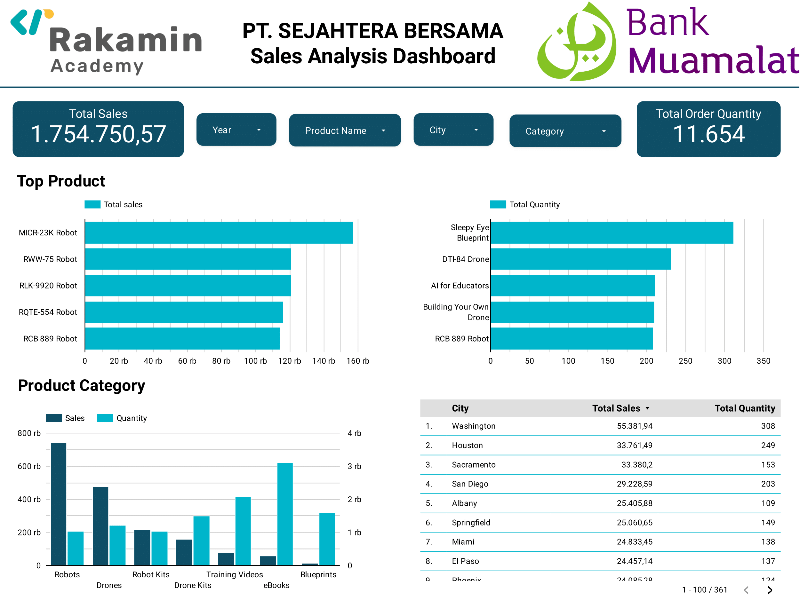

# Business Intelligence Analyst Project Based Internship Program held by Bank Muamalat and Rakamin Academy

## Overview

This project is the final project of the **Business Intelligence Analyst Project Based Internship Program held by Bank Muamalat and Rakamin Academy**.

This project involves the analysis of sales data to gain insights into the sales performance of a company called PT. Sejahtera Bersama.

## Dashboard

You can access the interactive dashboard through Looker Studio:

[Access the Dashboard](https://lookerstudio.google.com/reporting/d2eeb881-e856-4411-88a6-1a4880193786/page/4ekgD)

## Video Presentation

To get a more in-depth understanding of the project and its findings, please refer to the following video presentations:

[Access the video presentation](https://)

---
